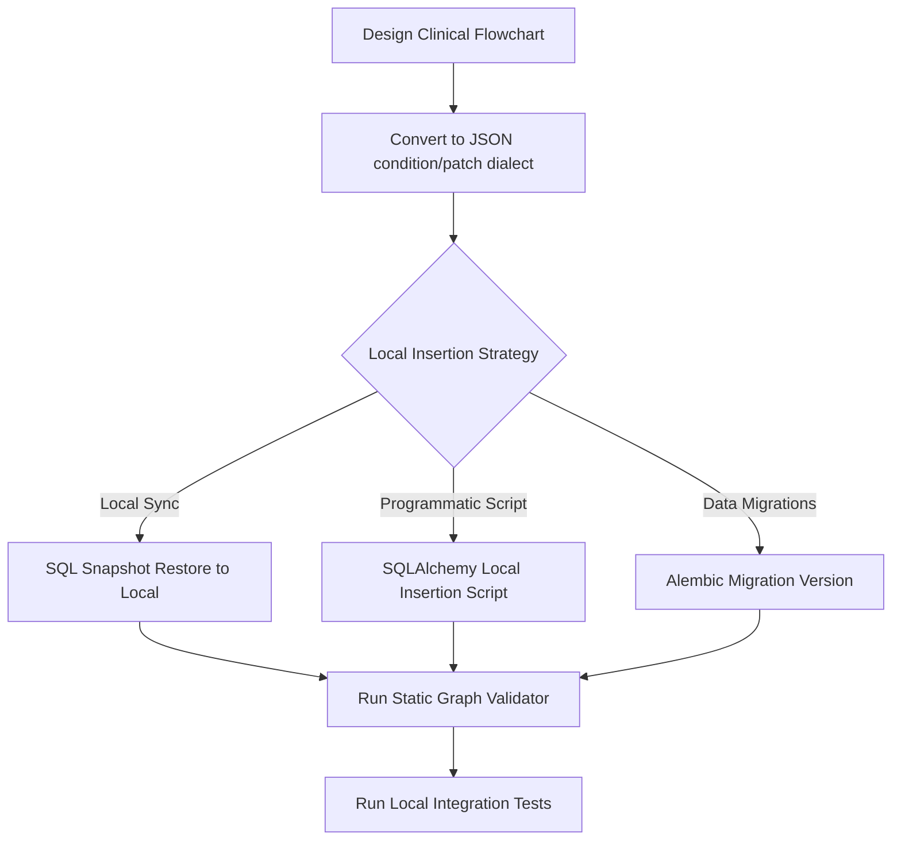

# CDSS Internal Directory and Architecture Guide

Welcome to the internal developer guide for the `cdss` source directory. This document outlines the package folder structure, lists the exact responsibilities of each file, and describes the workflow for inserting and validating new decision trees.

---

## 📁 Folder Structure Overview

The source code under [src/cdss](file:///c:/Users/Huy/Desktop/cdss/src/cdss) is split into three primary layers following clean architecture principles, plus helper modules:

```text
src/cdss/
├── domain/            # Pure traversal and clinical logic engine (Framework agnostic)
│   └── decision_tree/ # Domain logic, contracts, conditions, patches, and validation
├── infrastructure/    # Database models, loaders, repositories, and cache layers
│   └── db/            # SQLAlchemy database structures
├── api/               # FastAPI routing layer and JSON schemas
│   ├── routes/        # Router endpoints
│   └── schemas/       # Request and response validators
├── core/              # Global application config and environment settings
├── testing/           # Helper test client setup fixtures
└── main.py            # App builder and entry point
```

---

## 📄 Detailed File Mapping

### 1. Domain Layer (`cdss.domain.decision_tree`)
Contains the core business rules. It has zero external dependencies on databases or web frameworks:
* **[contracts.py](file:///c:/Users/Huy/Desktop/cdss/src/cdss/domain/decision_tree/contracts.py)**: Holds domain-level structures like [RunState](file:///c:/Users/Huy/Desktop/cdss/src/cdss/domain/decision_tree/contracts.py#L17) (tracks mutations during evaluation), [TraversalResult](file:///c:/Users/Huy/Desktop/cdss/src/cdss/domain/decision_tree/contracts.py#L19) (final execution output), and enums like [NodeType](file:///c:/Users/Huy/Desktop/cdss/src/cdss/domain/decision_tree/contracts.py#L16).
* **[graph.py](file:///c:/Users/Huy/Desktop/cdss/src/cdss/domain/decision_tree/graph.py)**: Defines immutable model objects [TreeGraph](file:///c:/Users/Huy/Desktop/cdss/src/cdss/domain/decision_tree/graph.py#L45), [NodeDefinition](file:///c:/Users/Huy/Desktop/cdss/src/cdss/domain/decision_tree/graph.py#L42), and [EdgeDefinition](file:///c:/Users/Huy/Desktop/cdss/src/cdss/domain/decision_tree/graph.py#L41) to decouple traversal logic from database ORM instances. Exposes the [TreeGraphRepository](file:///c:/Users/Huy/Desktop/cdss/src/cdss/domain/decision_tree/graph.py#L46) interface.
* **[walker.py](file:///c:/Users/Huy/Desktop/cdss/src/cdss/domain/decision_tree/walker.py)**: Implements [walk_tree](file:///c:/Users/Huy/Desktop/cdss/src/cdss/domain/decision_tree/walker.py#L55), the main stateless traversal logic that iterates through nodes and evaluates edges.
* **[conditions.py](file:///c:/Users/Huy/Desktop/cdss/src/cdss/domain/decision_tree/conditions.py)**: Evaluates target candidate conditions (`all`, `any`, `not`), operators (`eq`, `in`, `lt`, `lte`, `gt`, `gte`), subtraction logic, and path existence.
* **[patches.py](file:///c:/Users/Huy/Desktop/cdss/src/cdss/domain/decision_tree/patches.py)**: Applies [context_patch](file:///c:/Users/Huy/Desktop/cdss/src/cdss/domain/decision_tree/patches.py#L48) payloads, merging static dictionary payloads and executing copy procedures.
* **[actions.py](file:///c:/Users/Huy/Desktop/cdss/src/cdss/domain/decision_tree/actions.py)**: Implements [collect_action](file:///c:/Users/Huy/Desktop/cdss/src/cdss/domain/decision_tree/actions.py#L15), called on `ACTION`/`END` node entry to deep-copy and append the node's `action_payload` onto `RunState.actions`.
* **[paths.py](file:///c:/Users/Huy/Desktop/cdss/src/cdss/domain/decision_tree/paths.py)**: Contains [resolve_runtime_path](file:///c:/Users/Huy/Desktop/cdss/src/cdss/domain/decision_tree/paths.py#L49), evaluating path strings (e.g. `input.current_clinic_sbp`) against runtime context dictionaries.
* **[validator.py](file:///c:/Users/Huy/Desktop/cdss/src/cdss/domain/decision_tree/validator.py)**: Performs static validation via [validate_tree_graph](file:///c:/Users/Huy/Desktop/cdss/src/cdss/domain/decision_tree/validator.py#L40) to guarantee safety (detects loops, checks for single start nodes, validating comorbidity links).
* **[errors.py](file:///c:/Users/Huy/Desktop/cdss/src/cdss/domain/decision_tree/errors.py)**: Lists strongly typed exceptions like [MissingRuntimePath](file:///c:/Users/Huy/Desktop/cdss/src/cdss/domain/decision_tree/errors.py#L33) or [TraversalCycleDetected](file:///c:/Users/Huy/Desktop/cdss/src/cdss/domain/decision_tree/errors.py#L42).

### 2. Infrastructure Layer (`cdss.infrastructure.db`)
Maps the domain structures to the persistent database schema:
* **[models.py](file:///c:/Users/Huy/Desktop/cdss/src/cdss/infrastructure/db/models.py)**: Defines SQLAlchemy relational models for `decision_trees`, `decision_nodes`, `decision_edges`, `node_source_references`, and `development_runtime_logs`.
* **[decision_tree_repository.py](file:///c:/Users/Huy/Desktop/cdss/src/cdss/infrastructure/db/decision_tree_repository.py)**: Implements [SqlAlchemyTreeGraphRepository](file:///c:/Users/Huy/Desktop/cdss/src/cdss/infrastructure/db/decision_tree_repository.py#L20). It loads a tree, its nodes, edges, and citation references in bulk using exactly **four database queries**.
* **[caching_repository.py](file:///c:/Users/Huy/Desktop/cdss/src/cdss/infrastructure/db/caching_repository.py)**: Employs [CachingTreeGraphRepository](file:///c:/Users/Huy/Desktop/cdss/src/cdss/infrastructure/db/caching_repository.py#L9) to cache loaded decision tree graphs in memory for subsequent requests.
* **[base.py](file:///c:/Users/Huy/Desktop/cdss/src/cdss/infrastructure/db/base.py)**: Database connections and transaction utilities.

### 3. Presentation Layer (`cdss.api`)
Exposes FastAPI routers and Pydantic validators:
* **[routes/evaluation.py](file:///c:/Users/Huy/Desktop/cdss/src/cdss/api/routes/evaluation.py)**: Exposes the stateless execution `POST /evaluate` endpoint.
* **[routes/fhir.py](file:///c:/Users/Huy/Desktop/cdss/src/cdss/api/routes/fhir.py)**: Transforms internal tree graphs into HL7 FHIR R4 objects (`PlanDefinition` and `Library`).
* **[routes/tree_graph.py](file:///c:/Users/Huy/Desktop/cdss/src/cdss/api/routes/tree_graph.py)**: Supplies custom JSON formats to the visualizer canvas.
* **[routes/health.py](file:///c:/Users/Huy/Desktop/cdss/src/cdss/api/routes/health.py)**: Simple liveness endpoint.
* **[dependencies.py](file:///c:/Users/Huy/Desktop/cdss/src/cdss/api/dependencies.py)**: FastAPI dependencies (e.g. db sessions, repos, and caching wrappers).
* **[errors.py](file:///c:/Users/Huy/Desktop/cdss/src/cdss/api/errors.py)**: Maps internal domain exceptions to serialized HTTP responses (such as 422 for type errors or 424 for unresolved links).

### 4. Configuration and Bootstrapping
* **[core/config.py](file:///c:/Users/Huy/Desktop/cdss/src/cdss/core/config.py)**: Defines application settings with Pydantic BaseSettings, loading values from `.env`.
* **[core/database.py](file:///c:/Users/Huy/Desktop/cdss/src/cdss/core/database.py)**: Lazily creates the process-wide SQLAlchemy [engine](file:///c:/Users/Huy/Desktop/cdss/src/cdss/core/database.py#L21) and [session factory](file:///c:/Users/Huy/Desktop/cdss/src/cdss/core/database.py#L30); exposes [get_db](file:///c:/Users/Huy/Desktop/cdss/src/cdss/core/database.py#L43) as the FastAPI session dependency.
* **[main.py](file:///c:/Users/Huy/Desktop/cdss/src/cdss/main.py)**: Instantiates the FastAPI application, mounts middlewares (CORS), registers error handlers, and includes routers.

---

## 🔄 Flow of Inserting New Trees into the Database

> [!WARNING]
> **Keep Seeding and Tree Modifications Local Only**
>
> All new decision trees and adjustments to existing configurations must be made and verified **locally only** (using the local Docker PostgreSQL `cdss` or `cdss_test` databases). Do not run insertions, schema modifications, or restore operations against any remote or production databases at this stage.

Since the repository does not contain a built-in UI for authoring decision trees, inserting new clinical trees requires loading data rows directly into the local database tables.



### Step 1: Design and Dialect Conversion
1. Map out the clinical decision-tree structure (nodes and prioritization of outgoing branches).
2. Write appropriate JSON condition expressions (`all`, `any`, comparison operators) and merge patches for each node following the [decision-tree JSON dialect contract](file:///c:/Users/Huy/Desktop/cdss/docs/cdss/tree-json-dialect.md).

### Step 2: Database Insertion (Local Only)

#### Method A: SQL Snapshot Restore (Local Environment Sync)
This is the standard approach to synchronize local databases with a clinical snapshot:
* Export a local SQL snapshot using the backup tool:
  ```bash
  uv run python backups/dump.py
  ```
* Restore it locally:
  ```bash
  uv run python backups/restore.py
  ```
  *Note: The restore script contains a fail-closed guard preventing executions against any non-local hosts.*

#### Method B: Programmatic Python Script (Local Seeding)
Developers can write scripts using the SQLAlchemy session to insert tree elements programmatically into the local DB:
```python
from uuid import uuid4
from cdss.infrastructure.db.models import DecisionTree, DecisionNode, DecisionEdge
from cdss.domain.decision_tree import NodeType

# 1. Insert parent Tree
new_tree = DecisionTree(
    id=uuid4(),
    tree_key="hypertension-new-strategy",
    name_en="New Strategy",
    name_vi="Phác đồ mới"
)
session.add(new_tree)
session.flush()

# 2. Insert Nodes
start_node = DecisionNode(
    id=uuid4(),
    tree_id=new_tree.id,
    node_key="T_START",
    node_type=NodeType.START,
    text_en="Start Evaluation",
    text_vi="Bắt đầu đánh giá"
)
session.add(start_node)
session.flush()

# 3. Repeat for Condition, Action, and End nodes, then link them with DecisionEdges
# 4. Commit session
session.commit()
```

#### Method C: Alembic Data Migrations
For local migrations, write custom python migrations under `alembic/versions`:
```python
def upgrade() -> None:
    # Execute transactional insertions
    op.execute("INSERT INTO decision_trees (id, tree_key, name_en, name_vi, ...) VALUES (...)")
```

### Step 3: Run Validation & Local Integration Tests
Every newly loaded tree **must** pass static structural checkups locally to verify clinical safety.
1. Run the static validator suite:
   ```bash
   uv run pytest -m database tests/db/test_seeded_tree_validation.py
   ```
   This loads the tree and runs [validate_tree_graph](file:///c:/Users/Huy/Desktop/cdss/src/cdss/domain/decision_tree/validator.py#L40) to check for loops, unreachable elements, or missing starting coordinates.
2. Verify patient scenarios against expected outcomes:
   ```bash
   uv run pytest -m database tests/db/test_mock_patient_scenarios.py
   ```
